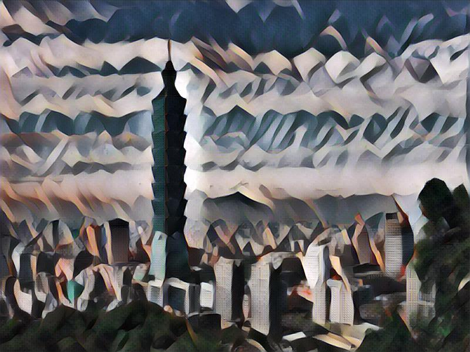

Neural Style Transfer is an algorithm for combining the content of one image with the style of another image 
using convolutional neural networks. Here's an example that maps the artistic style of The Starry Night 
onto a night-time photograph of the Stanford campus:


We will use this example to demonstrate how Floyd can be used to deploy your trained model as a REST API endpoint that can be accessed over the web. 
This feature is very useful if you want to quickly compare models or have others play with your models. This guide will 
walk you through how to do this.

## Setup project

For this guide we will be using [Fast Style Transfer](https://github.com/floydhub/fast-style-transfer)
project.

```bash
$ git clone https://github.com/floydhub/fast-style-transfer
$ cd fast-style-transfer
$ floyd init fast-style-transfer
Project "fast-style-transfer" initialized in the current directory
```


## Train a model

You can train your model by running the `style.py` script in this repo on Floyd. You can specify any style image to use in the command line. Just 
download it and keep it in current path. In this example we will be starting from a 
[pre-trained model](https://github.com/floydhub/fast-style-transfer#evaluating-style-transfer-networks).

### Training data

This project also requires access to the imagenet-vgg-verydeep-19 model and image training data. Floyd already has this data source available.
You can mount this at runtime using the `--data` parameter.

### Training

```bash
$ floyd run --gpu --env tensorflow-0.12:py2 --data narenst/datasets/coco-train-2014/1:images --data narenst/datasets/neural-style-transfer-pre-trained-models/1:models --data narenst/datasets/imagenet-vgg-verydeep-16/1:vgg "python style.py --vgg-path /vgg/imagenet-vgg-verydeep-16.mat --train-path /images/train2014 --style examples/style/la_muse.jpg --base-model-path /models/la_muse.ckpt --epoch 1 --total-iterations 10 --checkpoint-dir /output"
```

This will kick off a new job on Floyd. This will take a few minutes to run and will generate the model. You can follow along the progress 
by using the [logs](../commands/logs.md) command. 

```bash
$ floyd logs <RUN_NAME> -t
```
Now you need to get the ID of the `Output` generated by your job. Floyd [info](../commands/info.md) can give you that information.

```bash
$ floyd info <RUN_NAME>
```


## Evaluate your model

You can evaluate the generated model by running `evaluate.py` on sample images. Use the output id from the training step
as the datasource in this step. Add any image you want to style transfer to the `images` directory. Then run `evaluate.py`.

```bash
floyd run --env tensorflow-0.12:py2 --data <REPLACE_WITH_OUTPUT_ID>:input "python evaluate.py --allow-different-dimensions  --checkpoint /input/fns.ckpt --in-path ./images/ --out-path /output/"
```
You can track the status of the run with the status or logs command.

```bash
$ floyd status <RUN_NAME>
$ floyd logs <RUN_NAME> -t
```

After the job finishes successfully, view the output directory to see the style transferred images. Run the floyd [output](../commands/output.md)
for this.

```bash
$ floyd output <RUN_NAME>
```


### Improving the model

You may notice that the output does not look great. That is because we ran the training for a small number of iterations. To train 
a fully working model try the train step again, this time without setting `--total-iterations` and increasing the `--epoch` to 2.
It takes about 8 hours to train a model that works well. You can instead try one of our pre-trained models in the next section.

## Evaluate pre-trained models

If you want to try out some awesome pre-trained models for various styles, you can use the datasource with models available publicly.
You can play with any of these model and style transfer any image you prefer. Just add them to `images` directory. And point to the 
right model in the `--checkpoint` parameter.

```bash
floyd run --env tensorflow-0.12:py2 --data narenst/datasets/neural-style-transfer-pre-trained-models/1:models "python evaluate.py --allow-different-dimensions  --checkpoint /models/la_muse.ckpt --in-path ./images/ --out-path /output/"
```

You can track the status of the run with the status command.

```bash
$ floyd status <RUN_NAME>
```

When the experiment is finished, you can see the style transferred images by running:

```bash
$ floyd output <RUN_NAME>
```


## Model API

You can now host this model as a REST API. This means you can send any image to this API as a HTTP request and it will be style transferred. 

### Serve mode

Floyd [run](../commands/run.md) command has a `serve` mode. This will upload the files in the current directory and run a special command - 
`python app.py`. Floyd expects this file to contain the code to run a web server and listen on port `5000`. You can see the 
[app.py](https://github.com/floydhub/fast-style-transfer/blob/master/app.py) file in the sample repository. This file handles the 
incoming request, executes the code in `evaluate.py` and returns the output.

*Note that this feature is in preview mode and is not production ready yet*

```bash
$ floyd run --env tensorflow-0.12:py2 --data narenst/datasets/neural-style-transfer-pre-trained-models/1:input --mode serve
Syncing code ...
RUN ID                  NAME                              VERSION
----------------------  ------------------------------  ---------
DJSdJAVa3u7AsFEMZMBBL5  floydhub/fast-style-transfer:5          5

Path to service endpoint: https://www.floydhub.com/expose/t4AdkU6awahkT3ooNazw8c

To view logs enter:
    floyd logs DJSdJAVa3u7AsFEMZMBBL5
```


### Sending requests to the REST API

Now you can send any image file as request to this api and it will return the style transferred image.

```bash
curl -o taipei_output.jpg -F "file=@./images/taipei101.jpg" https://www.floydhub.com/expose/t4AdkU6awahkT3ooNazw8c
```


You will see the default style ([la_muse](https://github.com/floydhub/fast-style-transfer/blob/master/examples/style/la_muse.jpg)) is applied to the input image.


### Trying out different models

You can also pass in the name of the checkpoint to use and the image will be style transferred accordingly:

```bash
curl -o taipei_udnie.jpg -F "file=@./images/taipei101.jpg" -F "checkpoint=udnie.ckpt"  https://www.floydhub.com/expose/MUDFXViCLArG2drppvU3nm
```



This uses a different style checkpoint to render the image. All the logic for this is present in the `app.py` file. You can update it to 
be as complex as you prefer.

{!contributing.md!}
