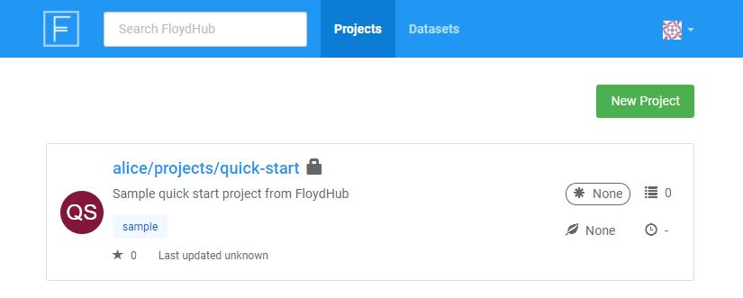

In this quick start guide, we will walk you through running your first project on FloydHub. We will train a simple convolutional neural network (CNN) model to recognize handwritten digits using Tensorflow and the MNIST dataset. For more details on the data and the model, please refer to the [Tensorflow tutorial](https://www.tensorflow.org/get_started/mnist/pros).

## What we will accomplish in this guide

- Learn about FloydHub's web dashboard and `floyd-cli` tool
- Initialize an existing project on your computer
- Run a job using `floyd run` command to train your deep learning model on FloydHub's GPU servers
- View the logs and stored output

## Quick preparation checklist

- You must have a [FloydHub account](https://www.floydhub.com/login)
- You must have `floyd-cli` [installed on your computer](../guides/basics/install.md)
- You must [log in to FloydHub through the CLI](../guides/basics/login.md)


## Web dashboard and floyd-cli

FloydHub has a [web dashboard](https://www.floydhub.com/projects) and a [CLI](../guides/install.md) that you can interact with from your terminal. If you are familiar with Github, think of the CLI tool (`floyd` command) as the equivalent of the `git` command. You can initialize projects, run jobs, view logs and outputs, etc. all using the CLI. 

The web dashboard is useful for getting an overview of your work and exploring others' projects and datasets.

## Setup

### Get the code
We will clone the [quick-start repository](TODO) from Github and run it on FloydHub. 

```bash
$ git clone https://github.com/floydhub/quick-start.git
Cloning into 'quick-start'...
$ cd quick-start
```

```bash
$ ls
$ mnist_cnn.py      mnist_cnn.ipynb
```

This repository contains two files: `mnist_cnn.py` (a Python script) and `mnist_cnn.ipynb` (a Jupyter Notebook). In this guide, we will use the Python script. We will explore running the Jupyter Notebook in our [next tutorial](./quick_start_jupyter.md).

### Initialize project
If you are a new user, you should see a default project named `quick-start` in your [Projects dashboard](https://www.floydhub.com/projects).



If you don't see it, you can create it using the following steps and still follow through with this guide:

```bash
TODO: Steps to clone a quick-start project
```

A [Project](../guides/core_concepts.md#projects) is a space for tackling a specific problem. It is a collection of jobs that you run, data, logs and results. If you have used GitHub, projects in FloydHub are a lot like code repositories.

Initialize your project in your current directory. 

```bash
$ floyd init quick-start
Project "quick-start" initialized in the current directory
```

This tells Floyd that all the jobs you run from this directory belong to the project named `quick-start`.

## Running your first job on FloydHub

A [Job](../guides/core_concepts.md#projects) is created when you execute a command inside a project on FloydHub. 

Running a job on FloydHub is simple. It is very similar to running code on your local machine. Instead, when you use the `floyd run` command, the CLI syncs your code to the FloydHub's servers and runs it in the cloud. 

For this tutorial, we will run the `mnist_cnn.py` Python script on FloydHub's GPU servers.

```bash
$ floyd run --gpu --env tensorflow "python mnist_cnn.py"
Syncing code ...
RUN ID                  NAME                    VERSION
----------------------  ----------------        ---------
AKpnXqj9BEU6d8KhmygTyb  saip/quick-start/1      1
...

[TODO: Is the job URL printed here?]
```

Congratulations! Your first jobs is now running on FloydHub's GPU. Behind the scenes, Floyd does the following:

- Sync your local code to FloydHub's server
- Provision a GPU instance on the cloud (because `--gpu`)
- Set up a deep learning environment with GPU drivers and Tensorflow installed (because `--env tensorflow`)
- Execute the command `python mnist_cnn.py` inside this environment
- Store the output logs and generated output data
- Terminate the GPU instance once the command finishes execution

## Next steps

### Check the status of your job

You can view the status of your job from your terminal using the [floyd status](../commands/status.md) command. You can specify a single job name (e.g. `floyd status <my-username>/quick-start/1`) to get its status, or the CLI will show the status of all jobs in the current project.

```bash
$ floyd status
[TODO: Fill]
```

You can also view the status of your job in your browser by visiting the `Job URL` printed by the `floyd run` command. For example, [www.floydhub.com/floydhub/quick-start/1](www.floydhub.com/floydhub/quick-start/1)

[TODO: Insert snip of job on the dashboard here]

### View output logs

You can view the logs generated by the job from your terminal using the [floyd logs](../commands/logs.md) command. You need to specify the job name.

```bash
$ floyd logs -t [TODO: Fill]
...
##############################################################################


##############################################################################
...
```

The output of your code is printed in the `Run Output` section of the logs, in between the printed `#########` lines. Anything you log or print in your code will appear here. Using the `-t` (tail) flag streams the logs as they are generated.

You can also view the logs in your browser using your `Job URL`. *Note:* Unlike the `-t` flag in the CLI, the logs displayed in the browser are currently *not* refreshed dynamically. Please refresh your browser periodically or press `F5`.

### View the output model

[TODO: Implement code and write]

### Iterating on your project

You can edit your code locally and run new jobs using the [floyd run](../commands/run.md) command. The CLI will upload the new version of your code and submit another job. FloydHub manages and keeps track of all the jobs you run in your project. 

To view all the jobs in your current project, you can either use the `floyd status` command from your CLI, or you can visit the `Project URL` in your browser.

Example: [www.floydhub.com/floydhub/quick-start](www.floydhub.com/floydhub/quick-start)

[TODO: Insert screenshot of project overview page]


{!contributing.md!}
