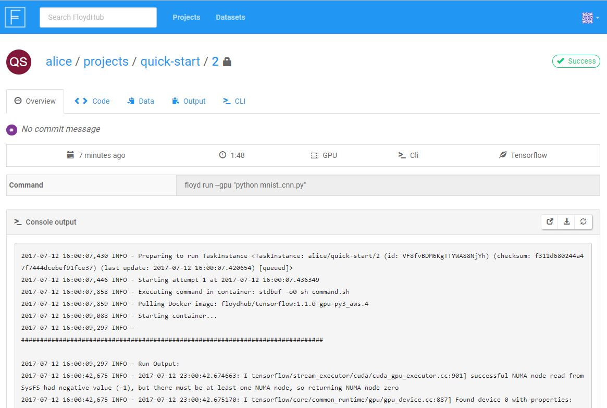
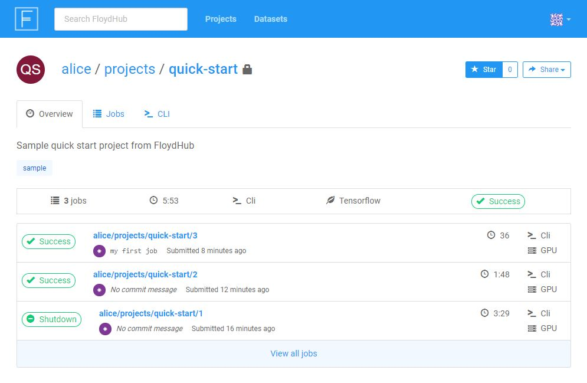

## Introduction

With this quickstart guide, we've tried to make it as easy as possible to get up and running with FloydHub.

We'll start with an overview of FloydHub and then jump into running your first job using TensorFlow and the MNIST dataset (better known as the "Hello, world!" of data science). We'll be training a convolutional neural network (CNN) model to recognize hand-written digits using FloydHub's GPU servers. For more details on the data and the model, please refer to the [Tensorflow documentation](https://www.tensorflow.org/get_started/mnist/pros).

## Platform overview

To help you get oriented with FloydHub, let's start by defining some basics:

### Tools

- **[`floyd-cli`](/guides/basics/install.md)**: Convenient command line tool to interact with FloydHub from your terminal
- **[Dashboard](https://www.floydhub.com/projects)**: Website to create, monitor, and explore Projects and Datasets

### Features

- **Job**: Command executed from the `floyd-cli` with optional configurations (including mounting Datasets, importing libraries like TensorFlow or PyTorch, running in Jupyter Notebook mode, or processing on GPU instances)
- **Project**: Collection of Jobs and their corresponding code, Datasets, logs, and results
- **[Dataset](/guides/data/mounting_data/)**: Input data that can be connected to a Project via a Job

## Setting up your first Project on FloydHub

### Quick preparation checklist
- [Create a FloydHub account](https://www.floydhub.com/login)
- [Install `floyd-cli` on your computer](../guides/basics/install.md)
- [Log in to FloydHub through `floyd-cli`](../guides/basics/login.md)

### Get the code
Clone the [quick-start repository](https://github.com/floydhub/quick-start) from GitHub onto your computer.

```bash
$ git clone https://github.com/floydhub/quick-start.git
Cloning into 'quick-start'...
...
$ cd quick-start
```

```bash
$ ls
LICENSE    mnist_cnn.py    mnist_cnn.ipynb    README.md
```

This repository contains two important files: `mnist_cnn.py` (a Python script to train a convolutional neural network model against the MNIST dataset) and `mnist_cnn.ipynb` (a Jupyter Notebook to interactively explore the MNIST dataset). 

In this quickstart tutorial, we'll only be using the Python script. Our separate [Jupyter Notebook tutorial](/getstarted/quick_start_jupyter.md) explains how to run this Project in Jupyter Notebook mode.

### Initialize your Project
If you're a new user, then you should already see a default Project named `quick-start` in your [Projects dashboard](https://www.floydhub.com/projects).


Alternatively, you can simply create a new Project named `quick-start` in the FloydHub Dashboard with these [instructions](../guides/basics/create_new/#create-a-new-project).

We'll need to link the Python model-training code with your `quick-start` Project on FloydHub. Use the `floyd init` command in the current directory of your terminal to initialize your Project. 

```bash
$ floyd init quick-start
Project "quick-start" initialized in the current directory
```

This tells FloydHub that all the Jobs you run from this local directory belong to your Project named `quick-start`.

## Running your first Job

Running a job on FloydHub is simple - when you use the `floyd run` command, the `floyd-cli` tool syncs your code with FloydHub's servers and runs the command in the cloud. 

FloydHub will run any command you provide as a new Job - even a Job as simple as listing your current directory with the `ls` command. However, FloydHub is specialized for running deep learning and data science processing commands.

For this tutorial, we'll run the `mnist_cnn.py` Python script on FloydHub's GPU servers to train our convolutional neural network model against the MNIST data.

```bash
$ floyd run --gpu --env tensorflow "python mnist_cnn.py"
Syncing code ...
NAME               
-------------------
alice/quick-start/1

To view the logs enter:
    floyd logs alice/quick-start/1
```

Congratulations! Your first job is now running on FloydHub's GPU servers. Behind the scenes, FloydHub does the following:

- Syncs your local code to FloydHub's servers
- Provisions a GPU instance on the cloud (because you set the `--gpu` flag)
- Sets up a deep learning environment with GPU drivers and Tensorflow installed (because you set the enviroment flag to `--env tensorflow`)
- Executes the command `python mnist_cnn.py` inside this environment
- Stores the output logs and generated output data
- Terminates the GPU instance once the command finishes execution

## Monitoring your Job

You can view the status of your Job from your terminal using the [`floyd status`](../commands/status.md) command. You can specify a single Job name (e.g. `floyd status alice/quick-start/1`) to get its status, or the `floyd-cli` will show the status of all Jobs in the current Project.

```bash
$ floyd status
JOB NAME             CREATED        STATUS    DURATION(s)  INSTANCE    DESCRIPTION
-------------------  ---------      --------  -----------  ---------   -----------
alice/quick-start:1  just now       running            15  gpu         
```

You can also view the status of your job in your browser by visiting the `Job URL` printed by the `floyd run` command. For example, `https://www.floydhub.com/alice/quick-start/1`



### Viewing your Job's logs

It's easy to view the logs generated by the job from your terminal with the [floyd logs](../commands/logs.md) command. You'll need to specify the Job name in the command.

```bash
$ floyd logs -t alice/quick-start/1
...
2017-07-12 16:00:07,446 INFO - Starting attempt 1 at 2017-07-12 16:00:07.436349
2017-07-12 16:00:09,088 INFO - Starting container...
2017-07-12 16:00:09,297 INFO - 
...
##############################################################################
2017-07-12 16:00:09,297 INFO - Run Output:
2017-07-12 16:01:46,154 INFO - Successfully downloaded train-images-idx3-ubyte.gz 9912422 bytes.
2017-07-12 16:01:46,158 INFO - Iter 1280, Minibatch Loss= 39855.289062, Training Accuracy= 0.17969
2017-07-12 16:01:46,159 INFO - Iter 2560, Minibatch Loss= 14964.132812, Training Accuracy= 0.42969
...
##############################################################################
...
```

The output of your code is printed in the `Run Output` section of the logs, between the `#########` lines. Anything you log or print in your code will appear here, so this is a great way to monitor the progress of your model training command. In our `quick-start` project, we're logging the Training Accuracy of our model.

Using the `-t` (tail) flag will stream the logs as they are generated.

You can also view the logs in your browser using your `Job URL`. However, the logs in the Dashboard are not currently refreshed dynamically, so you'll need to refresh your browser periodically or press `F5` to get the latest logs from the Dashboard.

### Viewing the Job output

The model that we trained in this quickstart tutorial does not save any new output models - instead it simply prints the model results to the logs. We'll explore how to save model outputs in the Jupyter Notebook tutorial.

## Iterating on your Project

Congratulations! You've run your first job on FloydHub 🎉

At this point, you can edit your Python code locally to make improvements or adjustments, and then kick off a new Job with the [floyd run](../commands/run.md) command. The `floyd-cli` will upload the newest versions of your code and submit another Job to the FloydHub servers. Along the way, FloydHub will be managing and tracking of all the iterations of Jobs within your Project.

You can always view details on all of the Jobs in your current Project with the `floyd status` command from your terminal, or by visiting the `Project URL` in your browser.

Example: `www.floydhub.com/alice/quick-start`



{!contributing.md!}
