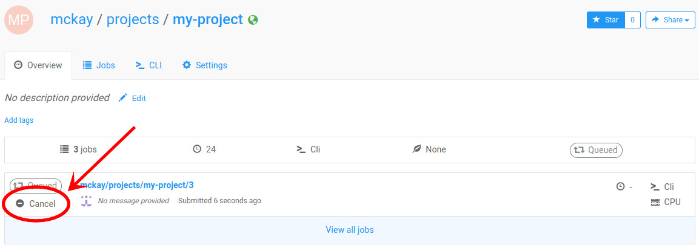
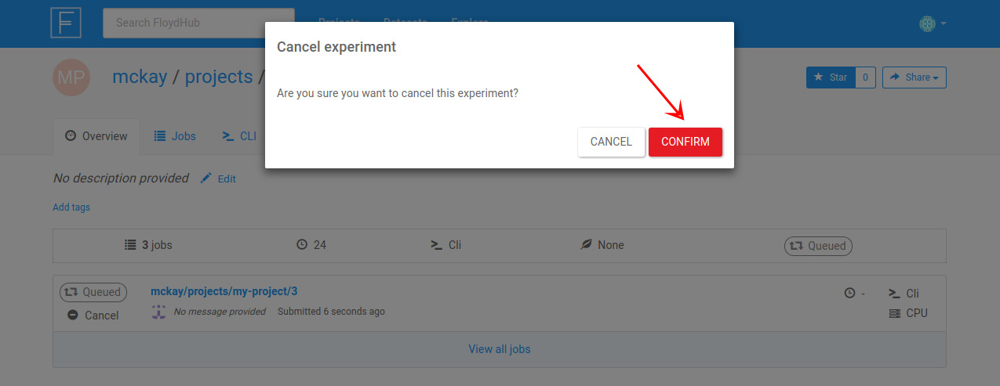

Follow this guide to learn how to spin up a Jupyter Notebook on FloydHub's deep-learning servers.

## Quick Preparation Checklist

- You must have a [FloydHub account](https://www.floydhub.com/login)
- You must have `floyd-cli` [installed on your computer](../guides/basics/install.md)
- You must [log in to FloydHub through the CLI](../guides/basics/login.md)


## Quick Start

1. Visit https://www.floydhub.com/projects/create and create a FloydHub
   project:
   

2. In your terminal, use Floyd CLI to initialize the project (be sure to use
   the name you gave the project in step one):

    ```
    $ floyd init my_jupyter_project

    Project "my_jupyter_project" initialized in current directory
    ```

3. Then, kick off your first Jupyter Notebook with
    `floyd run --gpu --mode jupyter`

    ```
    $ floyd run --mode jupyter

    Creating project run. Total upload size: 198.0B
    Syncing code ...
    [================================] 946/946 - 00:00:00

    JOB NAME
    -----------------------------------
    mckay/projects/my_jupyter_project/1

    Setting up your instance and waiting for Jupyter notebook to become available .............

    Path to jupyter notebook: https://floydlabs.com/notebooks/gaftzXTdaPtQtQ9NvEieNg
    ```

    This will open up a Jupyter Notebook in your browser. The notebook is
    running on FloyHub's GPU servers. Just like that, you're up and running!

Congratulations! You've just started your first Jupyter Notebook on FloydHub 🎉

To go a bit more in-depth and learn more about using Jupyter Notebooks on FloydHub, check out the [Getting Started Tutorial - Jupyter Notebook](get_started_jupyter) or you can watch this 3-minute Lightning Video on running Jupyter Notebooks on FloydHub:

## Stopping your Notebook

On the project page, click the `Cancel` button below the icon that shows the status of your job, as shown in the picture below:



Then click the `Confirm` button in the modal that pops up:


!!! warning
    Jupyter Notebooks are designed for interactive development. Your job starts running on FloydHub's server when you execute the `floyd run --mode jupyter` command and it continues to be active till you explicitly stop your job.

    Hence, even if you are not actively executing code inside your Notebook, the Jupyter server is still active on FloydHub and you are billed for the time.

## Video Tutorial

<iframe width="560" height="315" src="https://www.youtube.com/embed/XPcRp_U-wZY?rel=0" frameborder="0" gesture="media" allow="encrypted-media" allowfullscreen></iframe>

{!contributing.md!}
