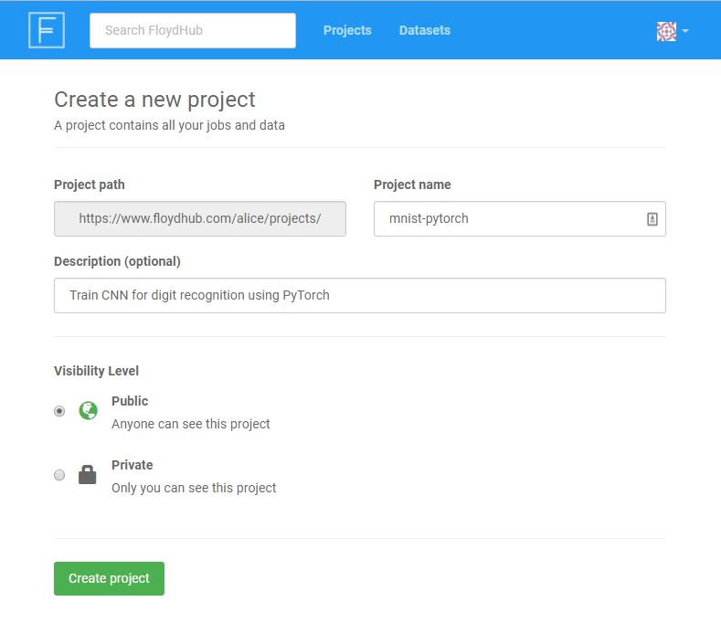

In this tutorial, we will run a Python [Jupyter Notebook](http://jupyter.org/) on FloydHub. Notebooks allow you to create and share documents that contain live code, visualizations and explanatory texts. This is an [example Notebook](TODO). It is great for interactively writing and debugging your code and visualizing your results and data. 

Similar to the [Quick Start guide](./quick_start.md), we will train a CNN model for handwritten digit recognition using PyTorch and the MNIST database.

If you are new to FloydHub, please ensure you have followed the [Quick Start guide](./quick_start.md) first. It introduces some important concepts used in this tutorial.

## What we will accomplish in this guide

- Learn how to create a new project on FloydHub
- Start a Jupyter notebook on FloydHub's GPU server
- Interactively run and debug your code
- Mount datasets to use in your code

## Quick preparation checklist

- You must have a [FloydHub account](https://www.floydhub.com/login)
- You must have `floyd-cli` [installed on your computer](../guides/install.md)
- You must [log in to FloydHub through the CLI](../guides/login.md)

## Setup

### Create a new project
For this tutorial, we will create a new Project. This project will be a collection of the jobs you run and their data, logs and results.

To create a new Project, visit [www.floydhub.com/projects](https://www.floydhub.com/projects) and click on the "New Project" button on the top right hand corner.



We will name this project `mnist-pytorch`. Feel free to provide an apt description.

The `Visibility` field indicates who can see your project. If you set it to `Public`, anyone can see your project, your code and data. If you are working on an open source project, this is a great way to share and contribute to the FloydHub community. If your code or data is proprietary, please select `Private`. This will ensure that only you and your team will have access to this project.

### Get the code
We will clone the [quick-start repository](https://github.com/floydhub/quick-start-pytorch) from Github to your local machine and run it on FloydHub. Run the `git clone` command in a brand new directory on your computer:

```bash
$ git clone https://github.com/floydhub/quick-start-pytorch.git
Cloning into 'quick-start-pytorch'...
$ cd quick-start-pytorch
```

```bash
$ ls
$ README.md mnist.ipynb
```

In this guide, we will use the `mnist_cnn.ipynb` Jupyter Notebook.

### Initialize new project
Now that we have the code, we want to associate this directory with the new project you just created on FloydHub. Ensure that you are inside the `quick-start-pytorch` directory and execute:

```bash
$ floyd init mnist-pytorch
Project "mnist-pytorch" initialized in the current directory
```

This tells Floyd that all the jobs run from this directory belong to the same project.

## Running Jupyter Notebook on FloydHub

Starting a Jupyter Notebook on FloydHub is very simple. Use the [floyd run](../commands/run.md) command with `--mode jupyter` flag.

Execute the following command from the command line:

```bash
$ floyd run --mode jupyter --gpu --env pytorch
Creating project run. Total upload size: 21.9KiB
Syncing code ...
Done=============================] 23333/23333 - 00:00:00
RUN ID                  NAME
----------------------  ---------------------
MhDNgxBHi74EKaffBKSbTN  saip/mnist-pytorch/3

Setting up your instance and waiting for Jupyter notebook to become available ..............

Path to jupyter notebook: https://www.floydhub.com/notebooks/pCoPyzZtYeo6mE9PpSWsmY

To view logs enter:
    floyd logs saip/mnist-pytorch/3

Opening the jupyter notebook in your browser now ...
```

This will take a little bit. As it executes, Floyd is doing the following behind the scenes:

- Sync your local code to FloydHub's server
- Provision a CPU instance on the cloud (if you want GPU, use the `--gpu` flag)
- Set up an deep learning environment with PyTorch installed (because `--env pytorch`)
- Start a Jupyter server on the cloud, and open the url in your browser

You can also open the link to the your Jupyter dashboard using the displayed URL. For example:


Open the `mnist.ipynb` Notebook and start training your model interactively!

## Next steps

### Check the status of your job

You can view the status of your job from your terminal using the [floyd status](../commands/status.md) command 

```bash
$ floyd status saip/mnist-pytorch/3
RUN ID                  CREATED         STATUS      DURATION(s)  NAME                   INSTANCE    DESCRIPTION
----------------------  --------------  --------  -------------  ---------------------  ----------  -------------
MhDNgxBHi74EKaffBKSbTN  16 minutes ago  running               0  saip/mnist-pytorch/3   gpu
```

You can also view the status by going to the project page in the web dashboard.

### Stopping your Notebook

**Important**: Jupyter Notebooks are designed for interactive development. Your job starts running on FloydHub's server when you execute the `floyd run --mode jupyter` command and it continues to be active till you explicitly stop your job.

*Hence, even if you are not actively executing code inside your Notebook, the Jupyter server is still active on FloydHub and you are billed for the time.*

To stop your notebook you can use the [floyd stop](../commands/stop.md) command.

```bash
$ floyd stop saip/mnist-pytorch/3
Experiment shutdown request submitted. Check status to confirm shutdown
```
{!contributing.md!}
