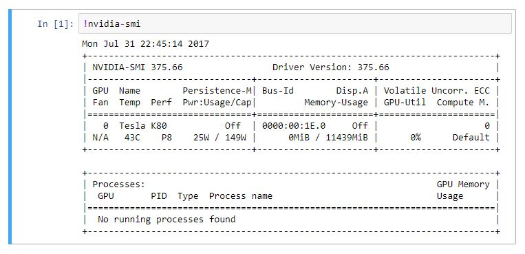

## Running your job on CPU vs. GPU

When you run a job using the [floyd run](../../commands/run.md) command, it is executed on a CPU instance on FloydHub's servers, by default. 

```bash
$ floyd run "python mnist_cnn.py"
```

You can also force your job to execute on on a CPU using the `--cpu` flag

```bash
$ floyd run --cpu "python mnist_cnn.py"
```


If you want to run your job on a GPU, simply add the `--gpu` flag. Just make sure your code is optimized to use the available GPU.

```bash
$ floyd run --gpu "python mnist_cnn.py"
```

### Checking GPU stats
You can check the GPU stats by running a dummy job that executes the `nvidia-smi` command.

```bash
$ floyd run --gpu "nvidia-smi"
Syncing code...
...

$ floyd logs -t <JOB_NAME>

# GPU stats displayed here
Mon Jul 31 22:45:14 2017       
+-----------------------------------------------------------------------------+
| NVIDIA-SMI 375.66                 Driver Version: 375.66                    |
|-------------------------------+----------------------+----------------------+
| GPU  Name        Persistence-M| Bus-Id        Disp.A | Volatile Uncorr. ECC |
| Fan  Temp  Perf  Pwr:Usage/Cap|         Memory-Usage | GPU-Util  Compute M. |
|===============================+======================+======================|
|   0  Tesla K80           Off  | 0000:00:1E.0     Off |                    0 |
| N/A   43C    P8    25W / 149W |      0MiB / 11439MiB |      0%      Default |
+-------------------------------+----------------------+----------------------+
                                                                               
+-----------------------------------------------------------------------------+
| Processes:                                                       GPU Memory |
|  GPU       PID  Type  Process name                               Usage      |
|=============================================================================|
|  No running processes found                                                 |
+-----------------------------------------------------------------------------+
```

If you are using a Jupyter Notebook, you can also just execute the `!nvidia-smi` command inside it. (*Make note* of the `!` character at the beginning of the command)

