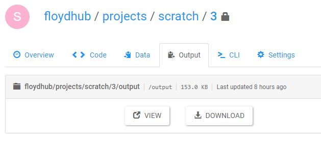

#### Overview
Saving information generated during a run is easy.

On a FloydHub deep learning server your code has access to a directory called
`/output`. The `/output` directory is a special directory that is used to store
information you want to save for future use after a job finishes. Anything
saved in the `/output` directory at the time a run finishes will be preserved
and can be accessed and reused later.

The most common thing users save is model checkpoints, but anything that ends
up in the `/output` directory at the end of a run will be saved (use your
imagination!).

Let's work through a couple of examples to see how to save data during a run.

#### Example 1
This job prints the string "Hello, world!", and saves it to a file called
`hello.txt`. Because `hello.txt` is located in the `/output` directory, it will
be saved and available after the job finishes:

```bash
$ floyd init my_awesome_hello_world_project
$ floyd run "echo 'Hello, world!' > /output/hello.txt"
Syncing code ...
```

!!! note
    If you are not familiar with what
    `echo 'Hello, world!' > /output/hello.txt` does, here's a quick
    explanation:

    - The `echo 'Hello, world!'` part outputs the string `Hello, world!`.
    - The `>` part of the command redirects the printed output of `echo 'Hello, world!'`
      (which is, of course, `Hello world!`) to the file specified after the `>`.
    - The `/output/hello.txt` part of the command specifies where the `Hello,
      world!` should be written to: `/output/hello.txt`. Because `hello.txt` is
      in the `/output` directory, it will be preserved for future reference and
      use.

#### Example 2
In this example, we'll use Python to save some data to a file in the `/output`
directory. Put this code in a file named `save_example.py`:

```python
with open('/output/myfile.txt', 'a') as f:
    f.write('Please save me!\n')
```

If you run this code locally on your computer, you'll probably get something
like this:

```bash
Traceback (most recent call last):
  File "save_example.py", line 1, in <module>
    with open('/output/myfile.txt', 'a') as f:
IOError: [Errno 2] No such file or directory: '/output/myfile.txt'
```

That's because there is no `/output` directory on your computer. In contrast,
every job on FloydHub runs on a server that has a `/output` directory, so the
command won't fail on FloydHub. Let's run it with the following commands:

```bash
$ floyd init save_example_2
$ floyd run "python save_example.py"
Creating project run. Total upload size: 267.0B
Syncing code ...
```
Success! We can now view the output, download it, or even use it again in
future jobs.

Now that we've completed a couple trivial examples, let's do something more
useful and realistic.

#### Example 3
Here is a sample Tensorflow example that saves a model checkpoint. Because we
write (save) the data to the `/output` directory, we'll be able to use it
later. A future job can use this model checkpoint as a starting point.
Consider this partial code, and note the call to `saver.save(sess,
'/output/model.ckpt')`:

```python
import tensorflow as tf

...

saver = tf.train.Saver()
with tf.Session() as sess:
    sess.run(init)
    ...
    save_path = saver.save(sess, '/output/model.ckpt')
    print("Model saved in file: %s" % save_path)
    ...
```

Because model is stored under the special `/output` directory, it will be saved
even after your job ends, and can be used again in future jobs. You can view
this output using the `floyd output` command:

```bash
$ floyd output floydhub/projects/quick-start/1/output
Opening output directory in your browser...
```

Alternatively, you can browse or download the saved output by visiting the
`Output` tab of the job on your dashboard as shown in the image below:



#### Using output as a data source

You can use the output of one job as the input to your next job. To see how to
mount output data, please see [this guide](./mounting_data#mounting-the-output-of-another-job)

{!contributing.md!}
