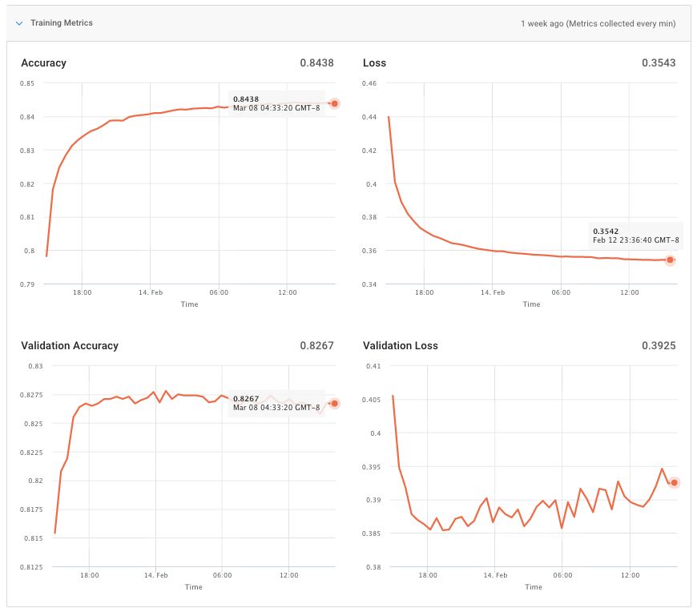

FloydHub provides various metrics for your training jobs in order to help you measure how well your job's training process is going. These metrics are visible as graphs on the job overview page.

Metrics are collected once every 60 seconds and will be updated in real time during a job's training process. Metrics will be retained after the job is completed - however, we are still determining the default retention period.

Metrics are grouped into two categories:

* **System Metrics**: System stats, such as CPU or GPU utilization
* **Training Metrics**: Custom training metrics, like training accuracy, loss, etc.

## System Metrics

System metrics provide insight into the system stats of your FloydHub training machine. These metrics will be automatically collected for all types of jobs - Command Mode and Serving Mode.


For all jobs, you will receive:

* **CPU Utilization:** Percentage of CPU usage by your training job
* **Memory Utilization:** Percentage of RAM usage by your training job
* **Disk Utilization:** Percentage of SSD usage by your training job

Additionally, for any GPU-powered jobs, you will receive:

* **GPU Utilization:** Percentage of GPU usage by your training job
* **GPU Memory Utilization:** Percentage GPU Memory by your training job

These metrics provide insight to help you optimize your training jobs. For example, the GPU Memory Utilization metric might indicate that you should increase or decrease your batch size to ensure that you're fully utilizing your GPU. It can also help you debug failed jobs due to out-of-memory (OOM) errors.

## Training Metrics

Training metrics come from the logs of the Python training script used by your job. FloydHub parses your job's output lines (anything printed to `stdout`) and automatically converts them into Training Metrics.



Currently, our system can identify and parse the default Keras logs, and FloydHub will automatically convert them to Training Metrics.

If you are using a different framework, such as PyTorch, you can still send your own training metrics data to `stdout.` FloydHub will not parse them automatically, but if you send them in JSON format with one metric per line, then we will be able to display them as Training Metrics.

Here is the basic format:
```python
print('{"metric": "<choose_metric_name>", "value": <int_or_float>}')
```

For example, if you want to report accuracy values:
```python
print('{"metric": "accuracy", "value": 0.985}')
# {"metric": "accuracy", "value": 0.985}
```
Or loss:
```python
print('{{"metric": "loss", "value": {}}}'.format(loss))
# {"metric": "loss", "value": 1.000000}
```

You can send any metric you want as a Training Metric, however the only values we accept currently are `float` or `integer` values. If you are interested in sending other values as custom training metrics, please let us know by sending an email to support@floydhub.com

!!! important
	Training metrics are currently only available for `Command Mode` jobs - not [Serving](../serving) jobs.
