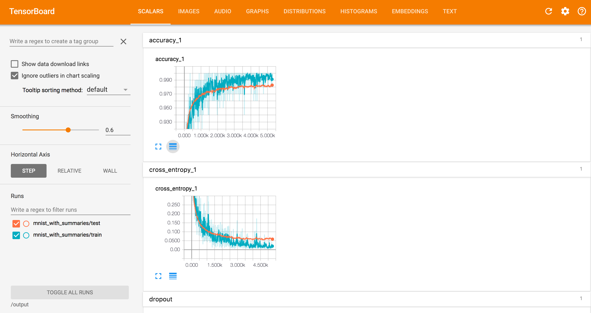
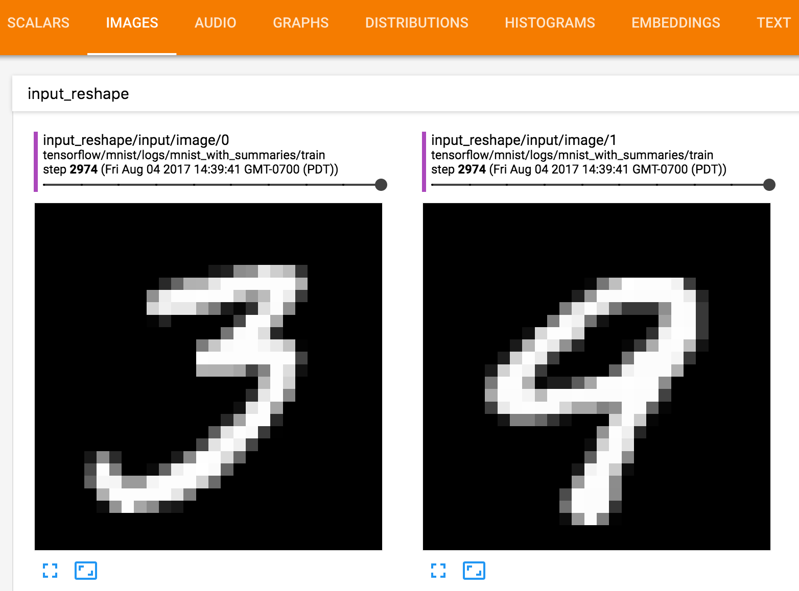

[TensorBoard](https://www.tensorflow.org/get_started/summaries_and_tensorboard)
is a visualization tool for TensorFlow projects. TensorBoard can help
visualize the TensorFlow computation graph and plot quantitative metrics about your run. This
guide will help you understand how to enable TensorBoard in your jobs.

## Key concepts of TensorBoard

If you would like to know more about the concepts of TensorBoard please check out
the [Tensorboard README](https://github.com/tensorflow/tensorflow/blob/r1.2/tensorflow/tensorboard/README.md#key-concepts)
file. This page also goes into the details of TensorBoard and explains the various
dashboards that are present in the Tensorboard UI.

## Enabling Tensorboard for your job or workspace

TensorBoard is enabled by default for all jobs and workspaces. No additional steps are needed to enable TensorBoard.

### Example Usage

This code snipped will train an MNIST model and also store the training summary
to a log directory.

```bash
git clone https://github.com/floydhub/tensorflow-examples
cd tensorflow-examples/tensorboard

# Initialize the current directory to an existing or new project
floyd init mnist-tensorboard
floyd run --tensorflow-1.5 "python mnist_tensorboard.py --log_dir tb_mnist_logs --max_steps 5000"
```

!!! important ""
    Notice that the the `log_dir` parameter is set to the current working directory.
    Be sure to send all data meant for TensorBoard to any directory under `/floyd/home` path.

Click on the job that was just started.


You will notice that the job page now has a link
to Tensorboard. Click on it to open the Tensorboard dashboard in a new tab.


### Tensorboard Dashboard



You can see that the "SCALARS" tab of Tensorboard is logging the accuracy of the
training and test data along with some other values. You may need to click on the title
bars (like `accuracy_1`) for the graph to open.

The reason why these values are appearing on the dashboard is because the
`mnist_tensorboard.py` code has the following lines:

```python
tf.summary.scalar('cross_entropy', cross_entropy)
...
tf.summary.scalar('accuracy', accuracy)
```

You can read more about how to use Tensorboard to log additional information in
the [Tensorboard README](https://github.com/tensorflow/tensorflow/blob/r1.2/tensorflow/tensorboard/README.md#key-concepts).

Explore the other tabs in the Tensorboad dashboard like "IMAGES" and "GRAPHS".

### Tensorboard Tabs



The IMAGES dashboard shows the transformations happening to the mnist images
in real time while the training is happening.


The GRAPHS dashboard shows a representation of Tensorflow's computation graph.
You can click into each part of the model to get more details.


### Stopping Tensorboard

Tensorboard runs in the same machine where your code is running. So you do not have
to stop it explicitly. It will be up until your job finishes and then stop automatically.
Tensorboard will become inaccessible when the job finishes in any of the `Success`, `Failed`,
`Timeout` or `Shutdown` states.

### Tensorboard with Workspaces

Tensorboard is always run inside Workspaces. Open the Tensorboard link in the bottom navbar next to the System Metrics to view Tensorboard from your running Workspace.

!!! important ""
    Notice that the the `log_dir` parameter is set to the current working directory.
    Be sure to send all data meant for Tensorboard to any directory under `/floyd/home` path.

## Offline Training

Until now, we saw how to use Tensorboard directly on Floydhub _while_ your job is actively running.
Alternatively you can also view the metrics offline after your
training is done.

For that, you need to first download the output of your project to your local
machine.

```bash
mkdir tensorboard_output && cd tensorboard_output
floyd data clone alice/mnist-tensorboard/1/
```

Then you need to install tensorflow in your local machine. The instructions depend
on your OS. See the Tensorflow install instructions [here](https://www.tensorflow.org/install/).

After that you can just run the `tensorboard` command and point it to the output
directory downloaded from Floydhub.

```bash
tensorboard --logdir=tensorboard_output
```

Then you can view the Tensorboard dashboard on your machine running at
[http://127.0.0.1:6006/](http://127.0.0.1:6006/)


## Video Tutorial on Tensorboard

<iframe width="560" height="315" src="https://www.youtube.com/embed/HZADAKZOf6U?rel=0" frameborder="0" gesture="media" allow="encrypted-media" allowfullscreen></iframe>


