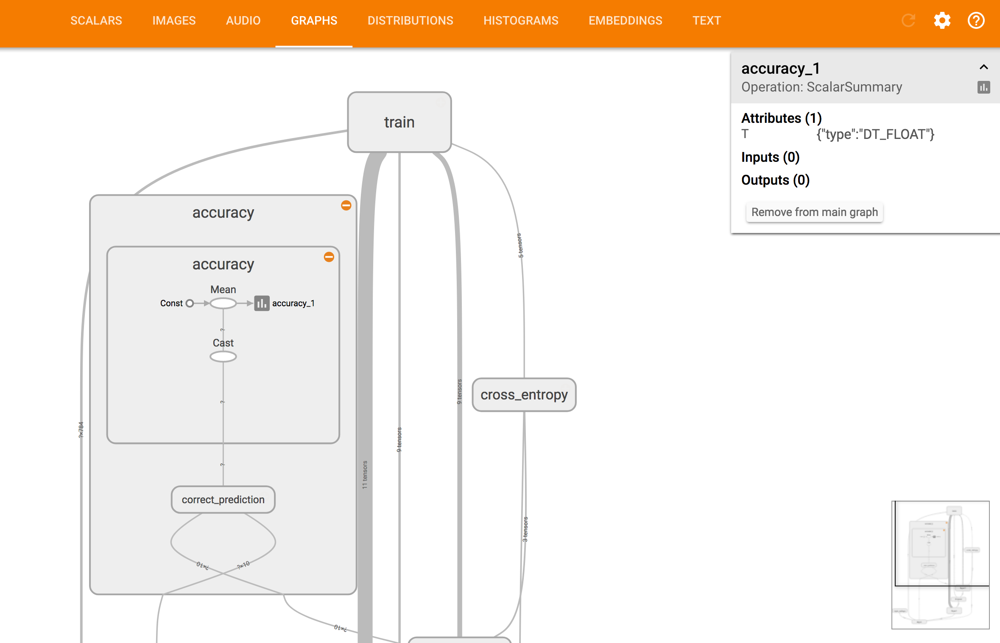

[Tensorboard](https://www.tensorflow.org/get_started/summaries_and_tensorboard) 
is a visualization tool for Tensorflow projects. Tensorboard can help 
visualize the Tensorflow computation graph and plot quantitative metrics about your run. This 
guide will help you understand how to enable Tensorboard in your jobs.

## Key concepts of Tensorboard

If you would like to know more about the concepts of Tensorboard please check out
the [Tensorboard README](https://github.com/tensorflow/tensorflow/blob/r1.2/tensorflow/tensorboard/README.md#key-concepts)
file. This page also goes into the details of Tensorboard and explains the various 
dashboards that are present in the Tensorboard UI.

## Enabling Tensorboard in your job

To enable Tensorboard in your job, you need to specify a `--tensorboard` flag 
when you run the job. Tensorboard can be enabled for both CLI jobs and when running 
Jupyter notebooks.

### Example

This code snipped will train an MNIST model and also store the training summary 
to a log directory.

```
git clone https://github.com/floydhub/tensorflow-examples
cd tensorflow-examples/tensorboard

# Initialize the current directory to an existing or new project
floyd init mnist-tensorboard
floyd run --tensorboard "python mnist_tensorboard.py --log_dir /output/mnist --max_steps 5000"
```

!!! important ""
    Notice that the the `log_dir` parameter is set to a path in the `/output` directory.
    On Floydhub, `/output` is a special directory that Tensorboard watches. Be sure to send 
    all data meant for Tensorboard to any directory under `/output` path.

Now you can view the job on your Project dashboard.


Click on the job that was just started. You will notice that the job page now has a link 
to Tensorboard. Click on it to open the Tensorboard dashboard in a new tab.


### Tensorboard Dashboard


You can see that the "SCALARS" tab of Tensorboard is logging the accuracy of the 
training and test data along with some other values. You may need to click on the title 
bars (like `accuracy_1`) for the graph to open.

The reason why these values are appearing on the dashboard is because the 
`mnist_tensorboard.py` code has the following lines:

```
tf.summary.scalar('cross_entropy', cross_entropy)
...
tf.summary.scalar('accuracy', accuracy)
```

You can read more about how to use Tensorboard to log additional information in 
the [Tensorboard README](https://github.com/tensorflow/tensorflow/blob/r1.2/tensorflow/tensorboard/README.md#key-concepts).

Explore the other tabs in the Tensorboad dashboard like "IMAGES" and "GRAPHS".

### Tensorboard Tabs


The IMAGES dashboard shows the transformations happening to the mnist images
in real time while the training is happening.



The GRAPHS dashboard shows a representation of Tensorflow's computation graph.
You can click into each part of the model to get more details.

!!! Note ""
    Tensorboard feature is only available for Tensorflow environments. 
    See [this](../environments.md) page for full list of Tensorflow environments you 
    can use.

### Stopping Tensorboard

Tensorboard runs in the same machine where your code is running. So you do not have 
to stop it explicitly. It will be up until your job finishes and then stop automatically. 
Tensorboard will become inaccessible when the job finishes in any of the `Success`, `Failed`, 
`Timeout` or `Shutdown` states.

### Tensorboard in Jupyter mode

Tensorboard can be run in Jupyter mode as well. You will notice that the links for both 
the Jupyter notebook and the Tensorboard appear in the Job page.


## Offline Training

Until now, we saw how to use Tensorboard directly on Floydhub _while_ your job is actively running. 
Alternatively you can also view the metrics offline after your 
training is done.

For that, you need to first download the output of your project to your local 
machine.

```
mkdir tensorboard_output && cd tensorboard_output
floyd data clone floydhub/mnist-tensorboard/6/output
```

Then you need to install tensorflow in your local machine. The instructions depend 
on your OS. See the Tensorflow install instructions [here](https://www.tensorflow.org/install/).

After that you can just run the `tensorboard` command and point it to the output 
directory downloaded from Floydhub.

```
tensorboard --logdir=tensorboard_output
```

Then you can view the Tensorboard dashboard on your machine running at 
[http://127.0.0.1:6006/](http://127.0.0.1:6006/)

