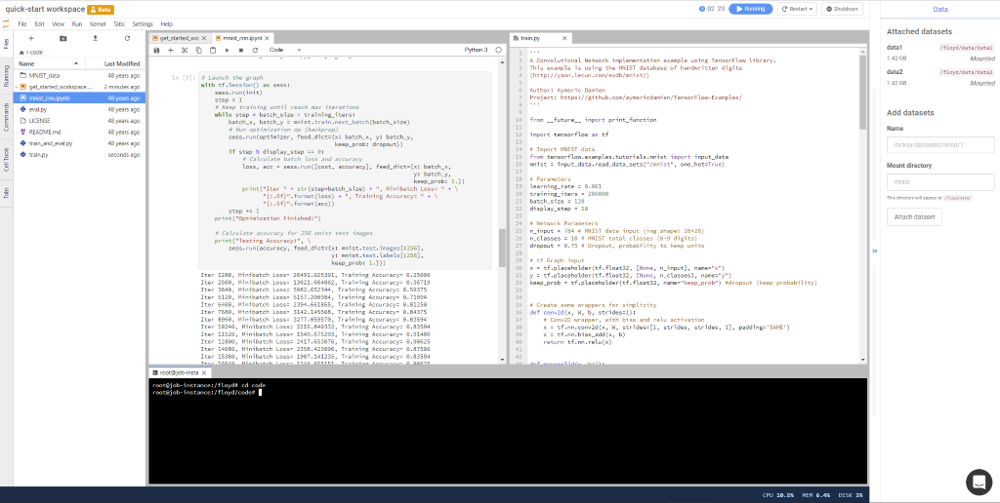
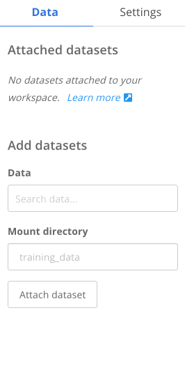
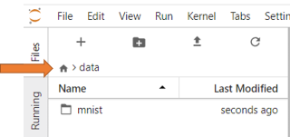
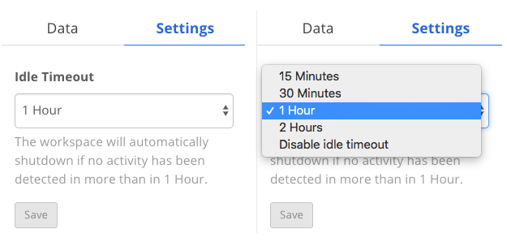
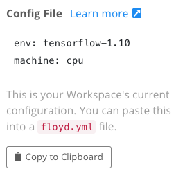

# Workspace

Workspace is an interactive environment ([Jupyter Lab](https://blog.jupyter.org/jupyterlab-is-ready-for-users-5a6f039b8906)) for developing and running code. You can run Jupyter notebooks, Python scripts and much more. All the files and data in your workspace will be preserved for you, across restarts. You can think of it as your persistent, on-demand machine on the cloud.



!!! important "Feedback request"
    Workspace is currently under active development. If you have feedback or feature requests, please let us know - via the chat bubble in your Workspace or email [support@floydhub.com](mailto:support@floydhub.com)

## Basics

### Creating a new workspace

To create a new workspace click the *Create Workspace* button in your project page. Choose the environment you need and the machine you want to use.


### Stopping a workspace

You can see the current status of your workspace in the top bar. If you want to stop this workspace, click the *Shutdown* button. All your files and directories in the current directory (`/floyd/home`) will be saved and persisted.


*Important: Save all your notebooks and files before shutting down the workspace. All running notebooks and scripts will be stopped during Shutdown.*

!!! error "Billing"
    You will be charged for the entire duration that your workspace is *running*. Please make sure to shutdown the workspace if you are no longer actively using it. You can [purchase powerups](https://www.floydhub.com/settings/powerups) if you are low on runtime to start a workspace.

### Resuming a workspace

You can resume working on a stopped workspace by clicking the *Resume* button in the project page. This will restore the workspace to its previous state.


## Code

Your workspace is located at `/floyd/home` on the filesystem. *Only* code and data files that you store in this directory will be preserved across restarts.

!!! warning "Store your files in /floyd/home"
    FloydHub only persists files that are stored under `/floyd/home`. Make sure you store all the files you want persisted here. Files stored in any other location will **not** be saved when your workspace is shutdown.

### Uploading code from local computer

You can upload your code and other files from your local machine using the upload button in the File Viewer panel (on the left).


*Make sure you upload your code into the `/floyd/home` directory.*

### Downloading code from Github

If your code is on Github (or any online repository), you can also clone your repository using the `git clone` command.

[Using the Terminal](#using-terminal):


Or, via your Jupyter Notebook cell:


You can now start working on your project. Open and run any Notebook or Python script. You can also edit code files and run them [using the terminal](#using-terminal).

## Using Terminal

You can open a Bash terminal (console) inside your workspace to run code, debug or inspect your files. To open a new terminal, click the *+* button in the File Viewer panel (on the left) and click *terminal* icon.


!!! note "Frozen terminal"
    If you terminal freezes due to inactivity, right click and select *Refresh Terminal*

    

## Data

### Downloading data from internet

If your data is available on the internet, you can also download it directly into your workspace [using the Terminal](#using-terminal).

```
# Ensure you're in your workspace directory
cd /floyd/home

wget http://yann.lecun.com/exdb/mnist/train-images-idx3-ubyte.gz
```

### Attaching FloydHub datasets

FloydHub provides an easy way to manage large datasets that you can use across projects. Instead of downloading your data everytime you start a workspace, you can [upload your data as a FloydHub dataset](https://docs.floydhub.com/guides/create_and_upload_dataset/).

You can attach FloydHub datasets to your workspace using the right panel. You need to specify the name of the dataset and the directory where you want to attach it. Once the data mounting finishes, you can start using the files in your code.

Example: Attaching the MNIST dataset [https://www.floydhub.com/mckay/datasets/mnist/1](https://www.floydhub.com/mckay/datasets/mnist/1)


Once you attach a dataset, it will be available even when you stop and resume the workspace. Currently there is no option to remove a mounted dataset.

*Tip:* You can hide the panel on the right by clicking the *>>* arrow on the panel.

#### Viewing attached datasets

All FloydHub datasets are attached under `/floyd/input`. You can view your attached datasets using the File Viewer panel. Make sure to click the *Home* icon and select the `data` dirctory.



You can also view them using [the Terminal](#using-terminal):

```bash
ls /floyd/input
```

## Settings

### Idle Timeout Detection

Workspaces have an idleness detection mechanism running in the background. If the workspace identifies that no jupyter is running in the workspace, it will start a timer and shutdown the workspace when that timer is up. You can configure or disable this timeout duration for within your workspace. The goal is to make sure you don't accidentally leave a workspace running and waste powerups.



!!! important "Idle timeout detection is disabled for terminals."
     If you plan to run long running commands or training inside terminal, remember to disable the idle timeout setting from the Settings.

### Config File Generator

If you are interested in sharing and making your workspace reproducible, you can use the Config File Generator for this. This feature will automatically generate a [floyd config file](/floyd_config.md) to reproduce the current Workspace session setup. This along with the [Run on FloydHub button](./run_on_floydhub_button.md) will make your projects increadibly easy to share.



## Switching between CPU and GPU

You can easily switch the instance type of your workspace using the *Restart* button.

For example: if you are working on a Jupyter notebook in a CPU instance, you can switch to a GPU instance to speed up your training. To restart your workspace click the "Restart" button and select the new instance you want to use.


You can [purchase powerups](https://www.floydhub.com/settings/powerups) if you are low on runtime to start a workspace.

!!! warning "Save your files before shutdown"
    Save all your notebooks and files before restarting the workspace. All running notebooks and scripts will be stopped during Restart.


